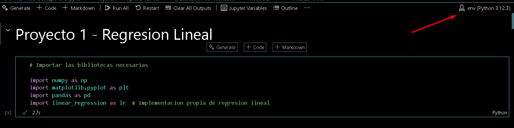

# Proyecto 1 - Regresión Lineal

## Activación del entorno virtual

1. **Crear el entorno virtual:**
	```bash
	python3 -m venv env
	```

2. **Activar el entorno virtual:**
	- En Linux/Mac:
	  ```bash
	  source env/bin/activate
	  ```
	- En Windows:
	  ```bash
	  env\Scripts\activate
	  ```

3. **Instalar las librerías desde `requirements.txt`:**
	```bash
	pip install -r requirements.txt
	```
>[!NOTE]
> Para desactivar el entorno virtual:
> ```bash
> deactivate
> ```

## Ejecución del proyecto

El desarrollo del proyecto se llevó a cabo íntegramente en Jupyter Notebook, utilizando Visual Studio Code junto con la extensión oficial [Jupyter](https://marketplace.visualstudio.com/items?itemName=ms-toolsai.jupyter) para su ejecución y visualización.

La organización del repositorio es la siguiente:

- [x] data/
- [x] src/
- [x] MY_README.md
- [x] README.md
- [x] requirements.txt

- La carpeta `data` contiene todos los archivos de datos y conjuntos de datos empleados en el análisis.
- En la carpeta `src` se encuentran los scripts y notebooks desarrollados para la resolución de las distintas etapas del proyecto:
  - Parte 1: `linear_regression.py`
  - Parte 2: `resultados_parte-2.ipynb`
  - Parte 3: `resultados_parte-3.ipynb`

Para consultar la resolución de cada sección, se recomienda acceder a los archivos correspondientes dentro de la carpeta `src` y ejecutar las celdas de los notebooks en el orden establecido.

>[!IMPORTANT]
> Si es primera vez utilizando Jupyter en VSCode habrá un símbolo a la derecha que indica `Select Kernel` alli deberá usar el del environment. Una vez seleccionado, debera tratar de ejecutar una celda, le sandrá un aviso de que debe instalar un componente adicional de Kernel, debe aceptar dicha instalacion y podra ejecutar las celdas del Jupyter.
> 